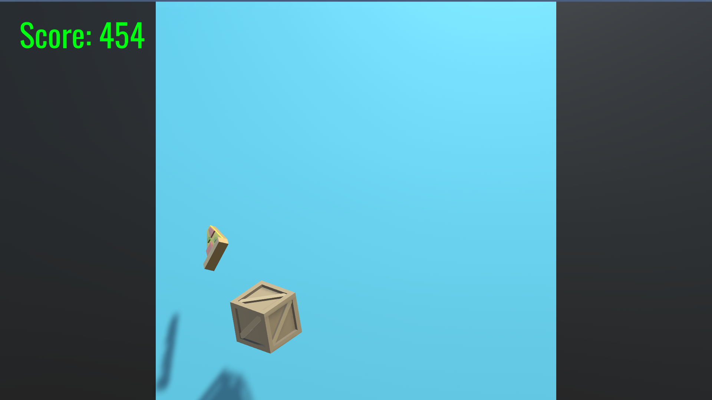

# ClickNinja
Game similar to fruit ninja created using Unity.

# Installation
The git repo 

# Screenshots

# Changelogs
1. v0
  * Same as the tutorial 
2. v0.1
  * Implemented destroy all cubes behaviour to the "Synty Cube"
  * Added particle lightning effect

# TODO
1. Add behaviour to the "Question Cube"
2. Add gem crystals that toss around from the sides
3. Make the background color change real time with fading effects
4. Fade the background music on pausing and restarting
5. Correct positioning of texts in UI
6. Add sticky lightning effect to the "Synty Cube", so that the particle effects moves to the nearby blocks
7. Add more intresting blocks
    
